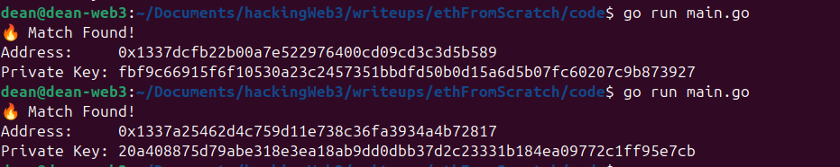

> This is *Vanity Walk* — a hands-on, code-first journey into Ethereum key generation and vanity address brute-forcing.  
> Built in Go with no magic libraries. Just curves, Keccak, and ~~goroutines~~ *(not yet)*.  
>
> If you've ever wanted to understand how Ethereum addresses are born — and how to bend them to your will — this project walks you through every byte.

---

